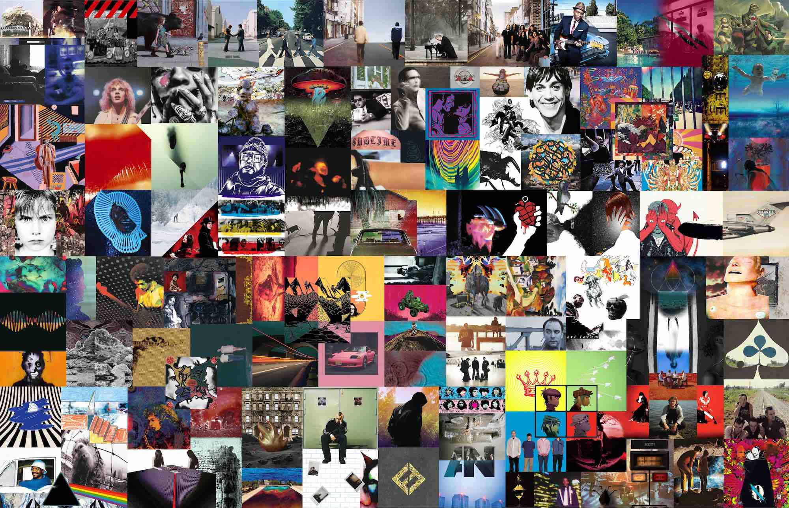
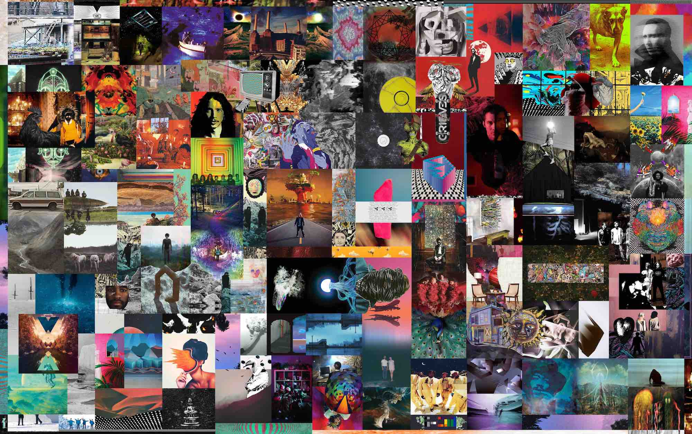

# spotify-cover-art
Very short python program that downloads high resolution images of album covers given a list of track and Spotify api credentials.

## Requirements
- install Spotipy

## Files to create:
- 'client_credentials.txt'
 First line contains your client id obtained from https://developer.spotify.com/documentation/web-api/
 Second line contains your secret client key
- 'tracks.txt'
 The file can easily be created by copying and pasting tracks into a textfile from the spotify desktop app.
 Each line should contain a track link in the format:
 https://open.spotify.com/track/track_id

## How to Use
Simply run the file and the highest resolution images of the album covers available will be downloaded to the same directory as the program. Sample files are added for reference but note that you *must* obtain your own spotify api credentionals or it will not work.

## How I Used this!
This program assisted me in making these wallpapers of my favorite album art.

